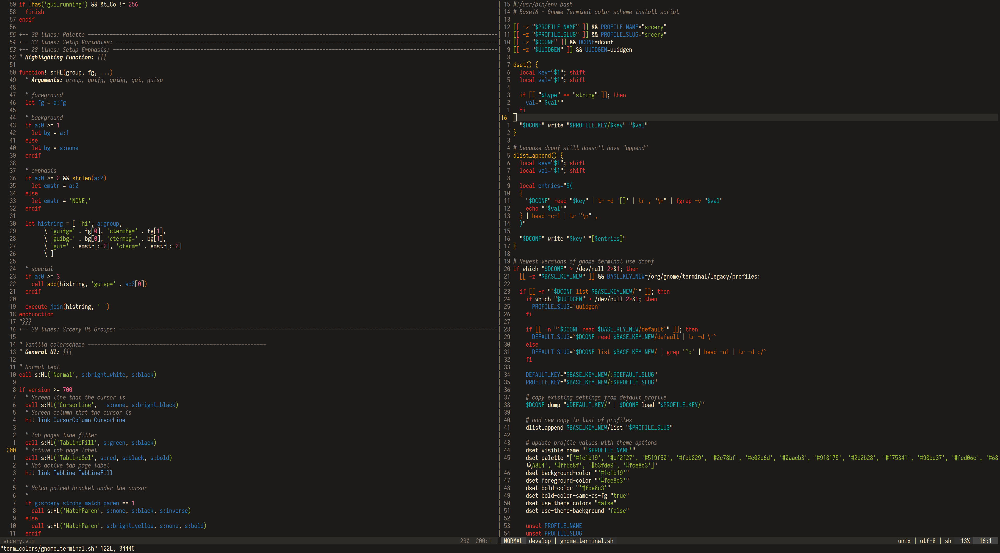
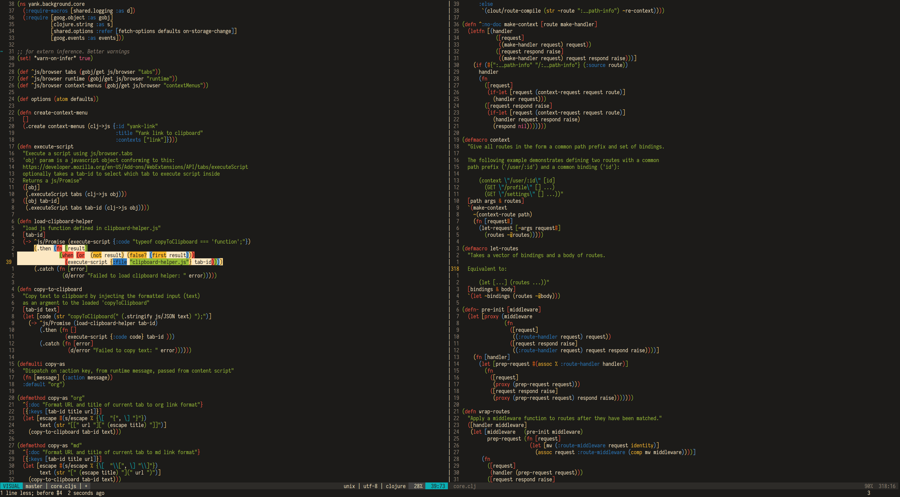
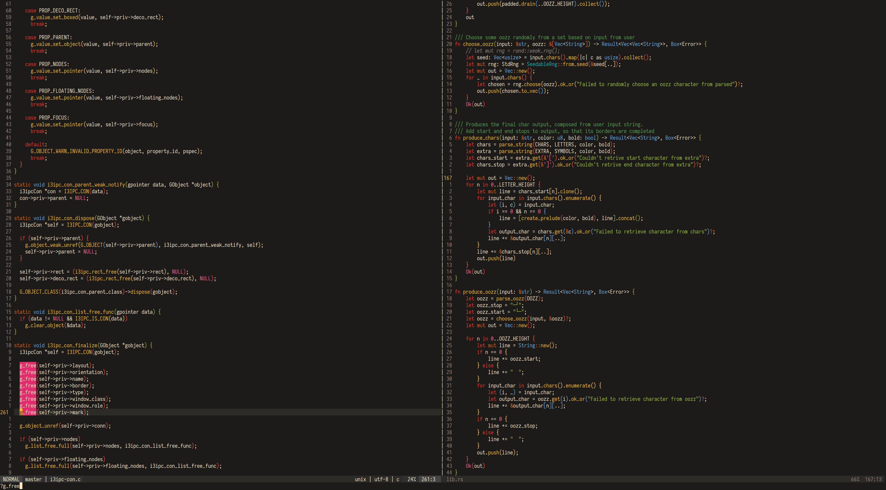
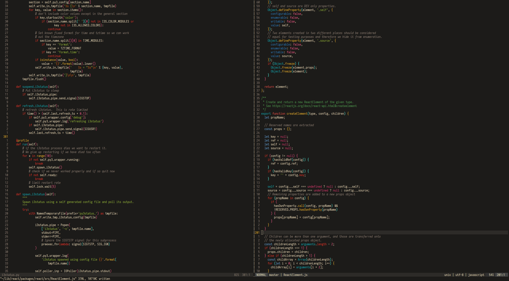

Colorscheme with clearly defined contrasting colors and a slightly earthy tone.

## Requirements

### GUI
You don’t need to do anything for this colorscheme to work in GVim or MacVim.

### TUI
To use Srcery in the terminal you need to change your terminal emulator’s
so-called “ASCII” colors to the ones in the table below. I've included
colorscheme files for various terminals in the term_color folder, but since I
haven't tested all of them some issues may arise. If your terminal is different
or the file won't work please let me know so I can add/update/fix the file in
question.

TERMCOL       | NR | HEX     | RGB
------------- | -- | ------- | ------------
black         |  0 | #1C1B19 | 28,  27,  25
red           |  1 | #EF2F27 | 239, 47, 39
green         |  2 | #519F50 | 81,  159, 80
yellow        |  3 | #FBB829 | 251, 184, 41
blue          |  4 | #2C78BF | 44, 120, 191
magenta       |  5 | #E02C6D | 224, 44,  109
cyan          |  6 | #0AAEB3 | 10, 174, 179
white         |  7 | #918175 | 145, 129, 117
brightblack   | 8  | #2D2C29 | 45, 44, 41
brightred     | 9  | #F75341 | 247, 83, 65
brightgreen   | 10 | #98BC37 | 152, 188, 55
brightyellow  | 11 | #FED06E | 254, 208, 110
brightblue    | 12 | #68A8E4 | 104, 168, 228
brightmagenta | 13 | #FF5C8F | 255, 92, 143
brightcyan    | 14 | #53FDE9 | 83, 253, 233
brightwhite   | 15 | #FCE8C3 | 252, 232, 195

If the colors still don't look right, ensure that 256 colors are enabled in vim by setting this option **before** setting the colorscheme.
```viml
set t_Co=256
```

## Installation

Put `srcery.vim` in `~/.vim/colors/` (on unix-like systems) or `%userprofile%\vimfiles\colors\` (on Windows).

Using a [plugin](https://github.com/junegunn/vim-plug) [manager](https://github.com/tpope/vim-pathogen) for vim.
```vim
Plug 'roosta/srcery'
```

## Configuration

I've included a few toggles due to discrepancies in the various setups possible.
To change any of these you'd put something like this in your `.vimrc`

```viml
let g:srcery_italic = 1
```

#### g:srcery_bold

Enables bold text.
default: 1

#### g:srcery_italic

Enables italic text.
default: gui 1, term 0

#### g:srcery_underline

Enables underlined text.
default: 1

#### g:srcery_undercurl

Enables undercurled text.
default: 1

#### g:srcery_inverse

Enables inverse colors.
default: 1

#### g:srcery_inverse_matches

Enables inverse search matches.
default: 0

#### g:srcery_inverse_match_paren

When enabled will inverse matching delimiters.

Works best with [Rainbow parenthesis](https://github.com/kien/rainbow_parentheses.vim)

default: 0

#### g:srcery_dim_lisp_paren

Dims lisp dialects delimiters to a fairly dark gray (xgray5 specifically)

default: 0

## Usage
```
:color srcery
```

If you like what you see and decide to make srcery your default colorscheme, add the relevant line to your vimrc:
```vim
colorscheme srcery
```
## Screenshots
Shell script, viml


clojure/script


c, rust


python, js


Typeface used in screenshots is [Iosevka](https://github.com/be5invis/Iosevka)

## Plugin support

### Lightline


[Lightline](https://github.com/itchyny/lightline.vim) colorscheme.
To use it, include 'srcery' value in lightline configuration, like so:

```vim
let g:lightline = {
      \ 'colorscheme': 'srcery',
      \ }
```

### Airline


Thanks to [MindTooth](https://github.com/MindTooth), Srcery now includes an [Airline](https://github.com/vim-airline/vim-airline) theme.

### Other

These don't require any additional configuration.

* [vim-gitgutter](https://github.com/airblade/vim-gitgutter)
* [vim-sneak](https://github.com/justinmk/vim-sneak)
* [ale](https://github.com/w0rp/ale)
* [CtrlP](https://github.com/ctrlpvim/ctrlp.vim)

Plugin support is still a work in progress and more will come, if there is
anything missing that you'd like to add please open an issue and let me know.

## Xterm colors
Srcery uses some [xterm
colors](https://en.wikipedia.org/wiki/Xterm#/media/File:Xterm_256color_chart.svg)
to pad out the color selection. Notable colors are:

```
TERMCOL    NR    HEX       RGB
-------    ---   -------   ----------
orange     166   #D75F00   215, 95, 0
brorange   208   #FF8700   255, 135, 0
hard_black 233   #121212   18, 18, 18
xgrey1     235   #262626   38, 38, 38
xgrey2     236   #303030   48, 48, 48
xgrey3     237   #3A3A3A   58, 58, 58
xgrey4     238   #444444   68, 68, 68
xgrey5     239   #4E4E4E   78, 78, 78
```

These colors relies on the 256 colors defined by your terminal, I don't change
any of these colors, I just rely on the xterm palette. This might look different
on different environments.

## Contributors

 * [MindTooth](https://github.com/MindTooth)
 * [schtibe](https://github.com/schtibe)
 * [jswinarton](https://github.com/jswinarton)

## Attribution

This project started as essentially a palette swap of [Gruvbox](https://github.com/morhetz/gruvbox) and all credit goes to the maintainers of that fantasic colorscheme. I wanted something a bit sharper, but I loved the syntax color choices of gruvbox. I also tried to make the theme as simple to use as possible, which was inspired by [Flattened](https://github.com/romainl/flattened). Other themes that influenced Srcery:

 * [Base16](http://chriskempson.com/projects/base16/)
 * [Badwolf](https://github.com/sjl/badwolf)
 * [Jellybeans](https://github.com/nanotech/jellybeans.vim)
 * [Molokai](https://github.com/tomasr/molokai)

## Extra
### Emacs

 Check out [emacs-srcery](https://github.com/roosta/emacs-srcery) 

### App config
 There is a [contrib repository](https://github.com/roosta/contrib-srcery) where
 everything that falls out of scope for the editor theme is maintained. App
 configs, extras and whatever else we can think of putting in there.
